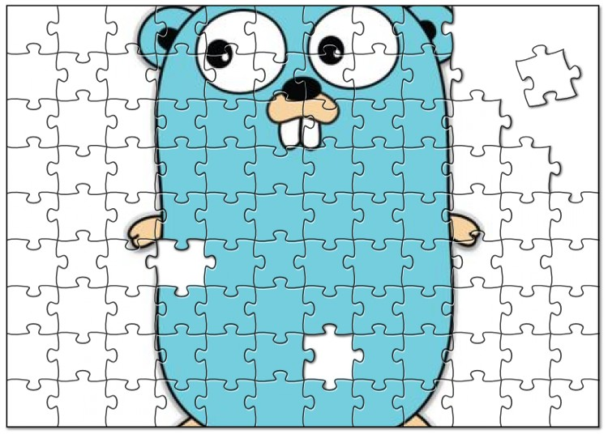

# Design Patterns for Go
 
[](https://pkg.go.dev/github.com/bvwells/go-patterns?tab=overview)

 
[](https://travis-ci.org/bvwells/go-patterns)
[](https://ci.appveyor.com/project/bvwells/go-patterns)
[](https://codecov.io/gh/bvwells/go-patterns)
[](https://goreportcard.com/report/github.com/bvwells/go-patterns)

Design patterns for the Go programming language.



``` go
import "github.com/bvwells/go-patterns"
```

To install the packages on your system,

```
$ go get -u github.com/bvwells/go-patterns/...
```

Documentation and examples are available at http://godoc.org/github.com/bvwells/go-patterns

 * [Design Patterns](#design-patterns)
 * [Creational](#creational)
 * [Structural](#structural)
 * [Behavioral](#behavioral)
 * [Go Versions Supported](#go-versions-supported)

## Design Patterns

Pattern    | Package                                   | Description
-----------|-------------------------------------------|------------
Creational | [`github.com/bvwells/go-patterns/creational`][creational-ref] | Creational design patterns are design patterns that deal with object creation mechanisms, trying to create objects in a manner suitable to the situation. The basic form of object creation could result in design problems or in added complexity to the design. Creational design patterns solve this problem by somehow controlling this object creation.
Structural | [`github.com/bvwells/go-patterns/structural`][structural-ref] | Structural design patterns are design patterns that ease the design by identifying a simple way to realize relationships between entities.
Behavioral | [`github.com/bvwells/go-patterns/behavioral`][behavioral-ref] | Behavioral design patterns are design patterns that identify common communication patterns between objects and realize these patterns. By doing so, these patterns increase flexibility in carrying out this communication.

## Creational [](https://godoc.org/github.com/bvwells/go-patterns/creational)

Name       | Description                               
-----------|-------------------------------------------
[`Abstract Factory`](./creational/abstract_factory.go) | Provide an interface for creating families of related or dependent objects without specifying their concrete classes.
[`Builder`](./creational/builder.go) | Separate the construction of a complex object from its representation, allowing the same construction process to create various representations.
[`Factory Method`](./creational/factory_method.go) | Define an interface for creating a single object, but let subclasses decide which class to instantiate. Factory Method lets a class defer instantiation to subclasses.
[`Object Pool`](./creational/object_pool.go) | Avoid expensive acquisition and release of resources by recycling objects that are no longer in use. Can be considered a generalisation of connection pool and thread pool patterns.
[`Prototype`](./creational/prototype.go) | Specify the kinds of objects to create using a prototypical instance, and create new objects from the 'skeleton' of an existing object, thus boosting performance and keeping memory footprints to a minimum.
[`Singleton`](./creational/singleton.go) | Ensure a class has only one instance, and provide a global point of access to it.

## Structural [](https://godoc.org/github.com/bvwells/go-patterns/structutal)

Name       | Description                               
-----------|-------------------------------------------
[`Adapter`](./structural/adapter.go) | Convert the interface of a class into another interface clients expect. An adapter lets classes work together that could not otherwise because of incompatible interfaces. The enterprise integration pattern equivalent is the translator.
[`Bridge`](./structural/bridge.go) | Decouple an abstraction from its implementation allowing the two to vary independently.
[`Composite`](./structural/composite.go) | Compose objects into tree structures to represent part-whole hierarchies. Composite lets clients treat individual objects and compositions of objects uniformly.
[`Decorator`](./structural/decorator.go) | Attach additional responsibilities to an object dynamically keeping the same interface. Decorators provide a flexible alternative to subclassing for extending functionality.
[`Facade`](./structural/facade.go) | Provide a unified interface to a set of interfaces in a subsystem. Facade defines a higher-level interface that makes the subsystem easier to use.
[`Flyweight`](./structural/flyweight.go) | Use sharing to support large numbers of similar objects efficiently.
[`Proxy`](./structural/proxy.go) | Provide a surrogate or placeholder for another object to control access to it.

## Behavioral [](https://godoc.org/github.com/bvwells/go-patterns/behavioral)

Name       | Description                               
-----------|-------------------------------------------
[`Chain of Responsibility`](./behavioral/chain_of_responsibility.go) | Avoid coupling the sender of a request to its receiver by giving more than one object a chance to handle the request. Chain the receiving objects and pass the request along the chain until an object handles it.
[`Command`](./behavioral/command.go) | Encapsulate a request as an object, thereby allowing for the parameterization of clients with different requests, and the queuing or logging of requests. It also allows for the support of undoable operations.
[`Interpreter`](./behavioral/interpreter.go) | Given a language, define a representation for its grammar along with an interpreter that uses the representation to interpret sentences in the language.
[`Iterator`](./behavioral/iterator.go) | Provide a way to access the elements of an aggregate object sequentially without exposing its underlying representation.
[`Mediator`](./behavioral/mediator.go) | Define an object that encapsulates how a set of objects interact. Mediator promotes loose coupling by keeping objects from referring to each other explicitly, and it allows their interaction to vary independently.
[`Memento`](./behavioral/memento.go) | Without violating encapsulation, capture and externalize an object's internal state allowing the object to be restored to this state later.
[`Observer`](./behavioral/observer.go) | Define a one-to-many dependency between objects where a state change in one object results in all its dependents being notified and updated automatically.
[`State`](./behavioral/state.go) | Allow an object to alter its behavior when its internal state changes. The object will appear to change its class.
[`Strategy`](./behavioral/strategy.go) | Define a family of algorithms, encapsulate each one, and make them interchangeable. Strategy lets the algorithm vary independently from clients that use it.
[`Template Method`](./behavioral/template_method.go) | Define the skeleton of an algorithm in an operation, deferring some steps to subclasses. Template method lets subclasses redefine certain steps of an algorithm without changing the algorithm's structure.
[`Visitor`](./behavioral/visitor.go) | Represent an operation to be performed on the elements of an object structure. Visitor lets a new operation be defined without changing the classes of the elements on which it operates.

## Go Versions Supported

The most recent major version of Go is supported. You can see which versions are
currently supported by looking at the lines following `go:` in
[`.travis.yml`](.travis.yml).

[creational-ref]: https://godoc.org/github.com/bvwells/go-patterns/creational
[structural-ref]: https://godoc.org/github.com/bvwells/go-patterns/structural
[behavioral-ref]: https://godoc.org/github.com/bvwells/go-patterns/behavioral
